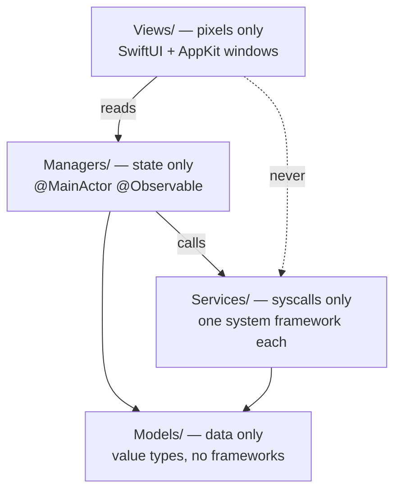
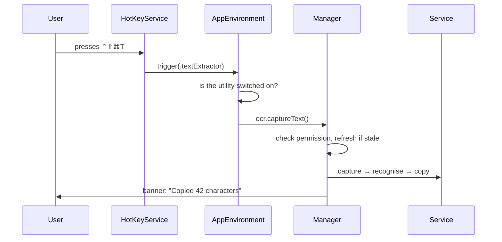
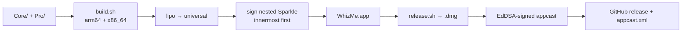

# Structure

How WhizMe is put together — folders, layers, and the rules about what may talk to what.

Last updated: 2026-08-17 · app version 0.1.4

---

## The whole repository

```
WhizMe.MacOs/
├── Core/                     Open source (MIT). Everything in the public repo.
│   ├── WhizMe/                   all Swift sources
│   └── Config/
│       ├── Info.plist            bundle metadata, Sparkle feed, permission strings
│       └── WhizMe.entitlements   sandbox off, Apple Events on, library validation off
│
├── Pro/                      Closed source. NOT in the public repo (gitignored).
│   ├── Sources/                  Pro Swift files, compiled into the same binary
│   └── README.md
│
├── Scripts/                  Build and release tooling (MIT)
│   ├── build.sh                  the real build — swiftc + actool + codesign
│   ├── release.sh                build → .dmg → signed appcast
│   ├── fetch-sparkle.sh          downloads Sparkle, verifies its checksum
│   ├── setup-signing.sh          creates the local signing certificate (run once)
│   └── check-signing.sh          confirms every build has one identity
│
├── Vendor/Sparkle/           Fetched, never committed. The one dependency.
├── .github/workflows/
│   ├── build.yml                 compiles the repo on a clean Mac, warnings = errors
│   └── appcast.yml               checks every download link in the feed still works
│
├── WhizMe.xcodeproj          for the Xcode Run button — NOT for releases
├── appcast.xml               the update feed Sparkle reads (committed)
├── build/                    build output (gitignored)
├── dist/                     release artifacts (gitignored)
│
├── report.md                 what changed and why, newest first
├── structure.md              this file
├── idea.md                   every feature and idea
├── whizme.md                 the original product spec
├── README.md                 developer documentation
└── .cursorrules              the rules AI agents and humans both follow
```

Keys live **outside** this folder, in `Whiz.Me/Keys/`. They must never enter the repo.

---

## The four layers

Code is separated by *what it is allowed to touch*. This is the rule most likely to be
broken by accident, so it is the one stated most plainly.



| Layer | Contains | May not |
| --- | --- | --- |
| `Models/` | Value types. Foundation only. | import AppKit or IOKit |
| `Services/` | One system-framework wrapper per file. Stateless. | be `@Observable`, own UI |
| `Managers/` | `@MainActor @Observable final class`. Orchestrates services. | call a system API directly |
| `Views/` | SwiftUI views, AppKit windows. | reach past a manager to a service |

`AppEnvironment` is the composition root and the **single** entry point for running a
utility. The menu bar and the global shortcut both call `trigger(_:)`, so "run Text
Extractor" has exactly one definition.

---

## Every file, and what it does

### Models — pure data

| File | Purpose |
| --- | --- |
| `WhizFeature.swift` | Every utility, its title, icon, category, permissions, and whether it ships |
| `SystemPermission.swift` | TCC permissions + deep links to the right System Settings pane |
| `HotKey.swift` | Key code + modifiers, and the shipping default shortcuts |
| `AwakeDuration.swift` | Indefinite, or 5m–4h |
| `SampledColor.swift` | An sRGB colour and its HEX/RGB/HSL text |
| `PasteFormat.swift` | The transformations Advanced Paste offers |
| `AppTheme.swift` | Light / dark / follow system |
| `FeatureCategory.swift` | Sidebar grouping |
| `AppInfo.swift` | Name, version, bundle id, repository links |

### Services — one system framework each

| File | Wraps | Used by |
| --- | --- | --- |
| `KeepAwakeService.swift` | IOKit power assertions | Awake |
| `ColorSamplerService.swift` | `NSColorSampler` | Color Picker |
| `ScreenCaptureService.swift` | ScreenCaptureKit | Text Extractor |
| `TextRecognitionService.swift` | Vision OCR | Text Extractor, Advanced Paste |
| `HotKeyService.swift` | Carbon `RegisterEventHotKey` | all shortcuts |
| `KeyboardBlockService.swift` | `CGEvent` tap | Clean Keyboard |
| `ClipboardService.swift` | `NSPasteboard` + accessibility | Advanced Paste |
| `PasteboardService.swift` | `NSPasteboard` (simple copy) | Color Picker, OCR |
| `NotificationService.swift` | `UNUserNotificationCenter` | banners, update reminders |
| `LaunchAtLoginService.swift` | `SMAppService` | Settings |
| `UpdateService.swift` | **Sparkle** — the only file that imports it | updates |
| `PermissionService.swift` | TCC status and requests | permissions |
| `CodeSigningService.swift` | how the running copy is signed | onboarding warning |

### Managers — observable state

| File | Owns |
| --- | --- |
| `AppEnvironment.swift` | The object graph, and `trigger(_:)` |
| `PermissionManager.swift` | TCC state, polling, System Settings fallback |
| `AwakeManager.swift` | Awake session and its countdown |
| `ColorPickerManager.swift` | Sampling state and the last 12 swatches |
| `OCRManager.swift` | Text Extractor's run sequence |
| `AdvancedPasteManager.swift` | The paste HUD and transformations |
| `CleanKeyboardManager.swift` | Keyboard-block session |
| `CleanScreenManager.swift` | Blackout session |
| `HotKeyManager.swift` | Which shortcut is bound to what, persisted |
| `PreferencesManager.swift` | Enabled utilities, theme, launch at login |
| `UpdateManager.swift` | Update state and Sparkle's UI callbacks |
| `AppActivationManager.swift` | `.accessory` ⇄ `.regular` — the single owner |
| `OverlayPresenter.swift` | Full-screen overlay windows |
| `OnboardingPresenter.swift` | The first-run window |

### Views

`MenuBarView` is the popover. `SettingsView` + `Settings/` is the settings window.
`RegionSelectionOverlay`, `CleanScreenOverlay`, `CleanKeyboardOverlay`, and
`AdvancedPasteHUDView` are the full-screen and floating surfaces.

---

## How a utility runs



Adding a utility touches four places and nothing else: a `WhizFeature` case, one service
per system API, one manager, and rows in `MenuBarView` / `SettingsView`.

---

## Build and release



Two things about this that are easy to get wrong:

**Releases only ever come from `./Scripts/release.sh`, never Xcode's Archive.** Xcode
signs the Sparkle framework but leaves the helpers nested inside it ad-hoc signed;
`build.sh` re-signs all of them with the project certificate.

**Debug is one architecture, release is two.** A release built for only the host
architecture cannot run on the other kind, and Sparkle would correctly refuse to offer
it to those Macs.

---

## Signing and updates

Two independent key pairs, both irreplaceable:

| Key | Protects | If lost |
| --- | --- | --- |
| Code-signing certificate | The app's identity, and therefore its TCC grants | Every user re-grants Screen Recording; Sparkle rejects all updates |
| Sparkle EdDSA key | Update authenticity | No further updates can ever be published |

The app is **not notarized** — there is no Apple Developer Program membership — so a
downloaded release costs the user one trip through System Settings → Privacy & Security.
Sparkle replaces the installed app in place, so that cost is paid once at install rather
than on every release. This is the main reason the updater matters here more than usual.

Updates are served entirely from GitHub:

- Feed: `raw.githubusercontent.com/AtharvaBari/WhizMe/main/appcast.xml`
- Downloads: `github.com/AtharvaBari/WhizMe/releases/download/v<version>/`
